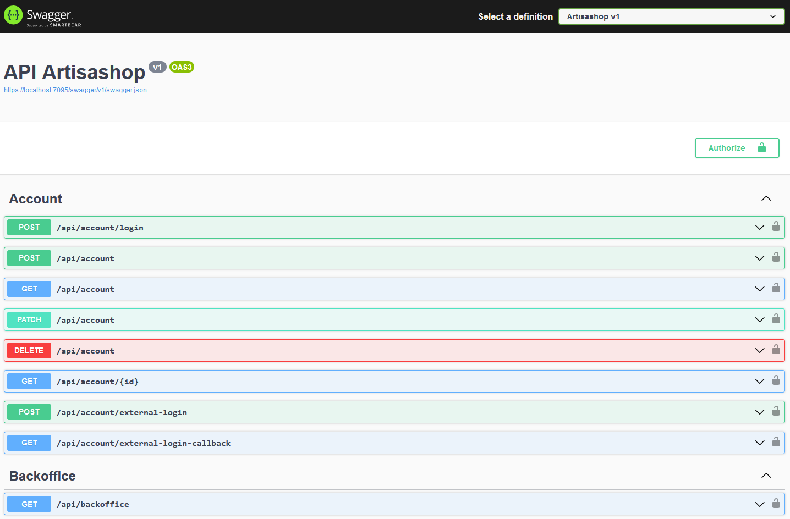
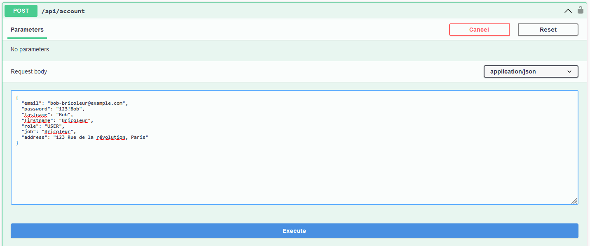
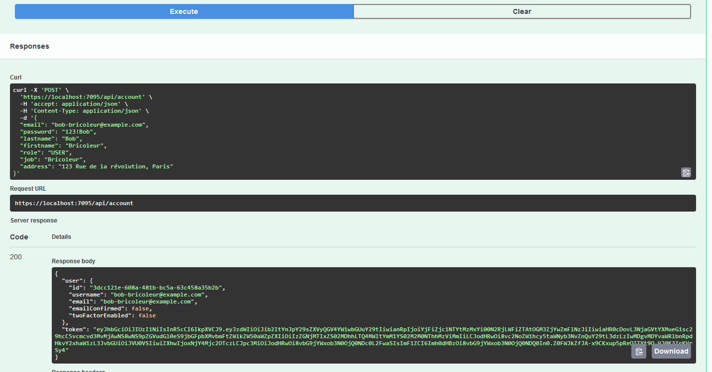
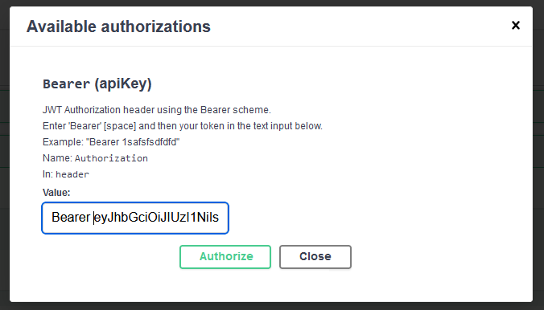

# Artisashop

## Tester l'API

Afin de tester l'API, il faut aller sur le lien suivant : <https://localhost:7095/swagger/index.html>



_Interface swagger d'Artisashop_

Afin d'utiliser les APIs pour lesquelles il faut être authentifié, il faut se connecter avec un compte utilisateur.
Pour cela, il faut cliquer sur le bouton "Authorize" en haut à droite de l'interface swagger,
puis entrer le token d'authentification dans le champ "Value" et cliquer sur le bouton "Authorize".



_Exemple de connexion avec Swagger. Dans le champ **role**, il faut mettre le rôle requis par la route API à tester._



_Récupérer la valeur du champ **token**._

La valeur du champ "token" est à copier dans le champ "Value" de l'interface swagger, avec le préfixe "`Bearer `".



Une fois identifié, il est possible de tester les différentes routes de l'API.

## Migrer la base de données

Lorsque les définitions ou les relations des modèles, il faut créer une migration

### Créer une migration

**bash**

```bash
read -p "Nom de la migration (ex. InitialCreate)" MigrationName
dotnet ef migrations add $MigrationName
```

**powershell**

```bash
$MigrationName = Read-Host -Prompt "Nom de la migration (ex. InitialCreate)"
dotnet ef migrations add $MigrationName
```

### Appliquer une migration

Cette commande applique les migrations sur votre base de données.

```bash
dotnet ef database update
```

### Annuler une migration

```bash
dotnet ef database drop
```

### Autres commandes

#### dotnet ef migrations

```
Usage: dotnet ef migrations [options] [command]

Options:
  -h|--help        Show help information
  -v|--verbose     Show verbose output.
  --no-color       Don't colorize output.
  --prefix-output  Prefix output with level.

Commands:
  add     Adds a new migration.
  bundle  Creates an executable to update the database.
  list    Lists available migrations.
  remove  Removes the last migration.
  script  Generates a SQL script from migrations.
```

#### dotnet ef database

```
Usage: dotnet ef database [options] [command]

Options:
  -h|--help        Show help information
  -v|--verbose     Show verbose output.
  --no-color       Don't colorize output.
  --prefix-output  Prefix output with level.

Commands:
  drop    Drops the database.
  update  Updates the database to a specified migration.
```